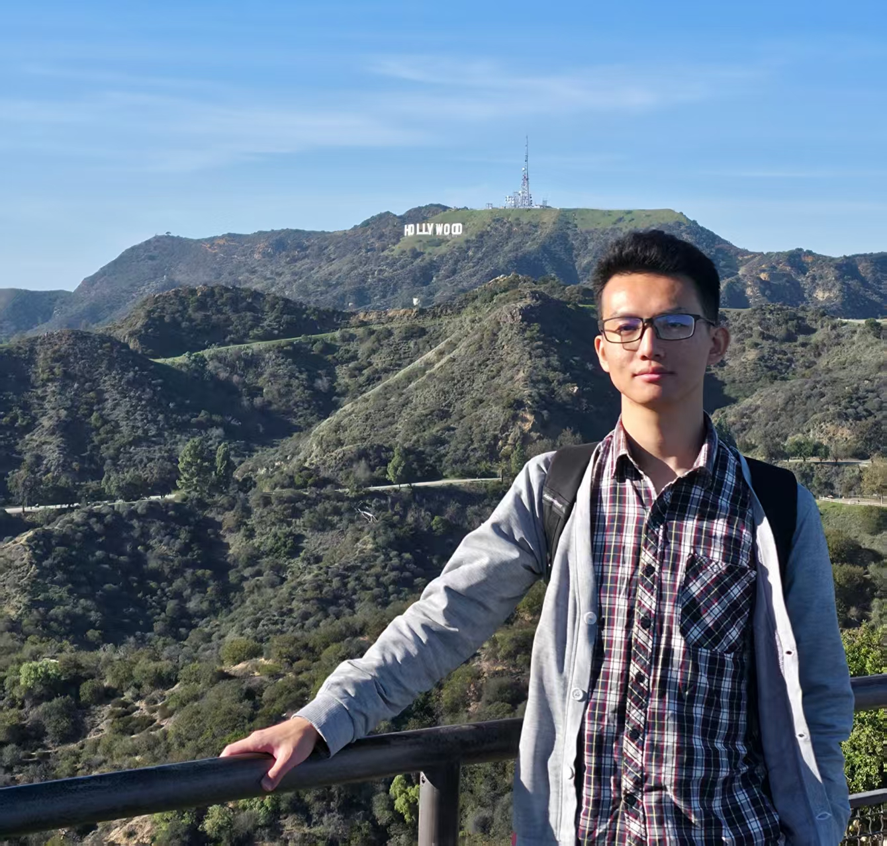

::: {.home-shell}
:::: {.hero}
::: {.hero-copy}
<div class="hero-name" role="heading" aria-level="1">Wensen Ma <span class="chinese-name">马文森</span></div>

[PhD in Applied Mathematics]{.hero-role}\
[The Hong Kong Polytechnic University]{.hero-institution}

**I study representation learning through distributional and generative perspectives.** My focus is self-supervised learning and its connection to generative learning; I also study the theory of language models.

::: {.profile-links}
[Email](mailto:vincen.math@gmail.com)
[Google Scholar](https://scholar.google.com/citations?user=LQnVgkQAAAAJ&hl=en)
[GitHub](https://github.com/vincen-github)
:::
:::
::: {.hero-photo}
{width=300 height=286}
:::
::::

::: {.bio}
I am pursuing my PhD in the Department of Applied Mathematics at The Hong Kong Polytechnic University, advised by Prof. [Defeng Sun](https://www.polyu.edu.hk/ama/people/academic-staff/prof-sun-defeng/?sc_lang=en) and Prof. [Houduo Qi](https://www.polyu.edu.hk/ama/people/academic-staff/prof-qi-houduo/?sc_lang=en). I received my bachelor's degree from Northwest University and my master's degree from Wuhan University, where I was advised by Prof. [Yuling Jiao](https://jszy.whu.edu.cn/jiaoyuling/en/index.htm). Prof. Jiao continues to advise me during my PhD, and we work closely together.
:::

## Bringing Generative Learning to Representation Learning {#research}

The starting point is the distribution of useful representations: can we learn an encoder by matching its outputs to a geometric reference? **Distribution Matching (DM)** develops this perspective; **Flow-Based Distribution Matching (FBDM)** extends it through flow matching.

:::: {.research-path}
::: {.research-step}
[01 · The perspective]{.eyebrow}

### Distribution Matching

[Recasting self-supervised learning as distribution matching opens the door to generative learning tools for representation learning.]{.research-highlight}

[Read the paper →](#dm){.text-link}
:::
::: {.research-step}
[02 · The flow-based extension]{.eyebrow}

### Flow-Based Distribution Matching

[What if a generative flow could learn representations rather than generate samples?]{.research-highlight}

[Explore FBDM →](#fbdm){.text-link}
:::
::::

## News {#news}

::: {.news-list}
- [Sep 2026]{.news-date} · [FBDM](https://arxiv.org/abs/2609.29350), a flow-based extension of our distribution-matching approach to self-supervised representations, is now available as a preprint.
- [Aug 2026]{.news-date} · We substantially revised [Distribution Matching](https://arxiv.org/abs/2502.14424), including its title and the connection between generative and representation learning.
:::

## Publications & Preprints {#publications}

[Authors are listed alphabetically by surname in all publications.]{.section-note}

::: {.publication #fbdm}
[2026 · Preprint]{.entry-meta}

### [Learning a Flow to Self-Supervised Representations](https://arxiv.org/abs/2609.29350)

[Yuling Jiao, **Wensen Ma**, Houduo Qi, Defeng Sun]{.authors}

::: {.paper-highlight}
What if a generative flow could learn representations rather than generate samples?
:::

::: {.entry-links}
[arXiv](https://arxiv.org/abs/2609.29350)
[PDF](https://arxiv.org/pdf/2609.29350)
[Code](https://github.com/vincen-github/FBDM)
:::
:::

::: {.publication #dm}
[2025 · Preprint · Revised 2026]{.entry-meta}

### [Bringing Generative Learning to Representation Learning: Self-Supervised Transfer Learning as Distribution Matching](https://arxiv.org/abs/2502.14424)

[Yuling Jiao, **Wensen Ma**, Defeng Sun, Hansheng Wang, Yang Wang]{.authors}

::: {.paper-highlight}
Recasting self-supervised learning as distribution matching opens the door to generative learning tools for representation learning.
:::

::: {.entry-links}
[arXiv](https://arxiv.org/abs/2502.14424)
[PDF](https://arxiv.org/pdf/2502.14424)
[Code](https://github.com/vincen-github/DM)
:::
:::

::: {.publication #language-models}
[2026 · Preprint]{.entry-meta}

### [Beyond the Prompt in Large Language Models: Comprehension, In-Context Learning, and Chain-of-Thought](https://arxiv.org/abs/2603.10000)

[Yuling Jiao, Yanming Lai, Huazhen Lin, **Wensen Ma**, Houduo Qi, Defeng Sun]{.authors}

We develop a theoretical framework to model and understand **zero-shot prediction, in-context learning, and chain-of-thought reasoning**. We seek to explain how demonstrations and intermediate reasoning steps can improve performance along the progression from zero-shot prediction to in-context learning and chain-of-thought.

::: {.entry-links}
[arXiv](https://arxiv.org/abs/2603.10000)
[PDF](https://arxiv.org/pdf/2603.10000)
:::
:::

::: {.publication #adv-ssl}
[2025 · NeurIPS · Poster]{.entry-meta}

### [Adv-SSL: Adversarial Self-Supervised Representation Learning with Theoretical Guarantees](https://proceedings.neurips.cc/paper_files/paper/2025/hash/b216ce49d808157ba14adec9453983a4-Abstract-Conference.html)

[Chenguang Duan, Yuling Jiao, Huazhen Lin, **Wensen Ma**, Jerry Zhijian Yang]{.authors}

We introduce a **minimax approach to debias existing self-supervised learning methods**. This adversarial formulation improves downstream performance while helping establish theoretical guarantees for the learned representations.

::: {.entry-links}
[Proceedings](https://proceedings.neurips.cc/paper_files/paper/2025/hash/b216ce49d808157ba14adec9453983a4-Abstract-Conference.html)
[arXiv](https://arxiv.org/abs/2408.08533)
[Code](https://github.com/vincen-github/ASSRL)
:::
:::

## Talks & Presentations {#talks}

Recent presentations on distribution matching and self-supervised representation learning include JCSDS 2026 in Guiyang, EAC-ISBA 2026 in Kunming, and a poster at NeurIPS 2025 in San Diego.

[View talks & presentations →](talks.qmd){.text-link}

## Awards {#awards}

::: {.award}
### NeurIPS 2025 Scholar Award
:::

::: {.award}
### Travel Award, Young Statisticians Association Annual Meeting, 2025

Third International Symposium on Statistical Theory and Applications, Doctoral Forum. Selected for an oral presentation and awarded travel support.

:::

## Open-source Projects {#projects}

::: {.project-entry}
### [mlimpl](https://github.com/vincen-github/mlimpl)

Readable implementations of machine learning algorithms for learning, prototyping, and reproducible research.

<a id="mlimpl-stars" class="star-count" href="https://github.com/vincen-github/mlimpl/stargazers" aria-label="637 GitHub stars for mlimpl" title="GitHub stars, refreshed when the page opens">★ <span id="mlimpl-star-count">637</span> stars</a>

[Explore on GitHub →](https://github.com/vincen-github/mlimpl){.text-link}
:::

```{=html}
<script>
document.addEventListener('DOMContentLoaded', async () => {
  const count = document.getElementById('mlimpl-star-count');
  const link = document.getElementById('mlimpl-stars');
  if (!count || !link) return;
  try {
    const response = await fetch('https://api.github.com/repos/vincen-github/mlimpl', {
      headers: { 'Accept': 'application/vnd.github+json' }
    });
    if (!response.ok) return;
    const repository = await response.json();
    if (!Number.isInteger(repository.stargazers_count)) return;
    count.textContent = new Intl.NumberFormat('en-US').format(repository.stargazers_count);
    link.setAttribute('aria-label', `${count.textContent} GitHub stars for mlimpl`);
  } catch (_) {
    // The verified count above remains visible if GitHub is unavailable.
  }
});
</script>
```

::: {.closing-links}
[Academic Service →](service.qmd)
[Get in touch →](mailto:vincen.math@gmail.com)
:::
:::
